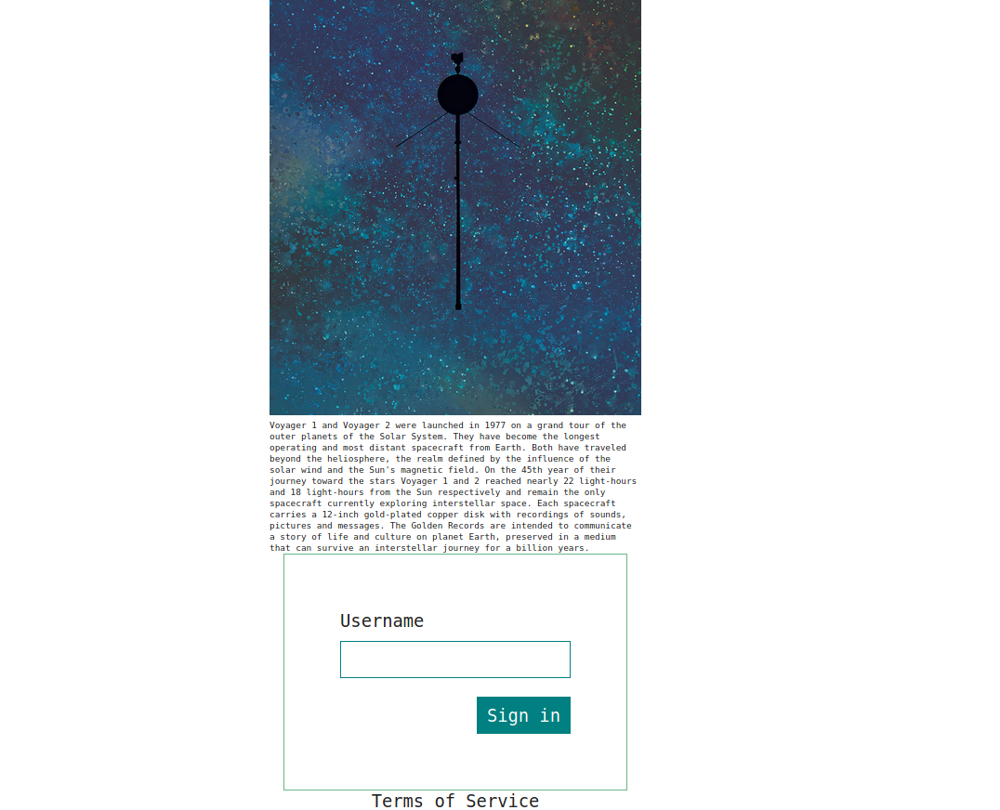
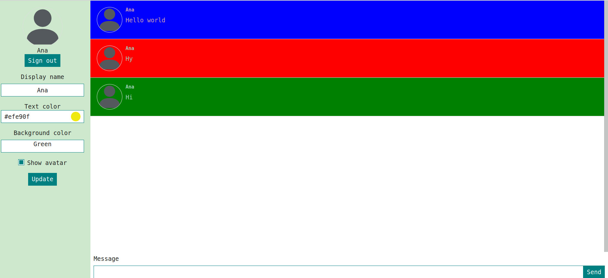

# Chat-app

Developed as part of Algebra`s Fronted developer course.

---

## Getting started

**Technologies**

- Javascript
- React
- CSS

**Requirements**

- Node.js 16.0.0+
- npm 7.10.0+

**First steps**

1. Clone this repository
2. Run `npm install`
3. Run `npm start`

## Scripts

### `npm run start`

Start the development environment.

### `npm run build`

Build the project for production.

## Features

- [x] Create text message
- [x] Send text message bx pressing "Enter" or the submit button (message is shown next to the name of the author)
- [x] Change background and colour of messages
- [x] Show Avatar image
- [x] Click on log-out button and leave chat-room
